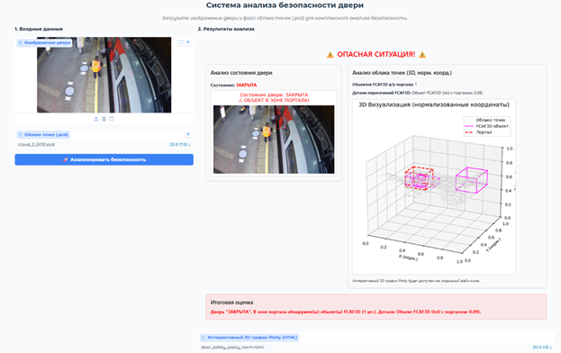

# 🚆 Система безопасности посадки/высадки пассажиров ж/д транспорта

## 📜 Описание проекта

Данный проект представляет собой выпускную квалификационную работу (ВКР) на тему: **"разработка системы оповещения, обеспечивающей безопасность посадки и высадки пассажиров железнодорожного транспорта"**.

Система предназначена для автоматического контроля дверных порталов вагонов с целью предотвращения зажатия пассажиров или их вещей автоматическими дверями. Она использует данные с RGB-камеры для определения состояния дверей и данные со стереокамеры (3D облака точек) для детекции людей и посторонних объектов в опасной зоне.

---

## 🎯 Цели и задачи

**Основная цель:** повышение уровня безопасности пассажиров железнодорожного транспорта за счет автоматизации контроля дверных проемов.

**Ключевые задачи:**
*   Разработка алгоритма определения состояния дверей (`OPEN`, `CLOSED`, `SEMI`, `UNKNOWN`) по RGB-изображениям с использованием нейронной сети ResNet18.
*   Разработка и сравнение двух подходов к детекции объектов (`HUMAN`, `OTHER`) в 3D облаках точек в зоне дверного портала:
    *   Нейросетевой подход на базе архитектуры FCAF3D.
    *   Аналитический подход на основе анализа плотности точек в заданной области.
*   Интеграция информации о состоянии дверей и наличии объектов для формирования итогового сигнала об опасности.
*   Реализация прототипа системы с пользовательским интерфейсом на Gradio для демонстрации работы.

---

## 🖼️ Концептуальная схема системы


*Рисунок 1 – Общая архитектура системы оповещения.*

---

## 🛠️ Используемые технологии

*   **Язык программирования:** Python 3.8+
*   **Глубокое обучение:**
    *   PyTorch (для ResNet18 и FCAF3D)
    *   ResNet18 (для классификации состояния дверей)
    *   FCAF3D (для 3D детекции объектов)
*   **Обработка 3D-данных:**
    *   Open3D (для работы с облаками точек .pcd)
    *   NumPy
*   **Обработка изображений:**
    *   Pillow (PIL)
    *   OpenCV (опционально, для дополнительных манипуляций)
*   **Веб-интерфейс:**
    *   Gradio
*   **Визуализация:**
    *   Matplotlib
    *   Plotly
*   **Ускорение вычислений:**
    *   Numba (для FPS в одной из версий)

---

## 🚀 Установка и запуск

### 1. Клонирование репозитория
```bash
git clone https://github.com/aak204/fcaf3d_project.git
cd fcaf3d_project
```

### 2. Создание виртуального окружения и установка зависимостей
Рекомендуется использовать виртуальное окружение:
```bash
python -m venv .venv
# Активация:
# Windows
.venv\Scripts\activate
# macOS/Linux
source .venv/bin/activate

pip install -r requirements.txt
```
*Примечание: убедитесь, что у вас установлены PyTorch с поддержкой CUDA, если вы планируете использовать GPU.*

### 3. Подготовка данных
*   Разместите датасеты (RGB-изображения и .pcd файлы с аннотациями) в папке `data/` согласно структуре, ожидаемой скриптами.
*   Убедитесь, что пути к данным и моделям в конфигурационных файлах или скриптах указаны корректно.

### 4. Запуск обучения (пример для FCAF3D)
```bash
python fcaf3d_project/tools/train.py
```
*Параметры обучения (пути к данным, выходная директория, гиперпараметры) настраиваются внутри скрипта или через аргументы командной строки (если реализовано).*

### 5. Запуск Gradio-интерфейса
Для запуска демонстрационного интерфейса:
```bash
python gradio/gradio_interface.py
```
После запуска интерфейс будет доступен в веб-браузере по указанному адресу (обычно `http://127.0.0.1:7860`).

---

## 📊 Примеры работы и результаты

### Определение состояния двери (ResNet18)
Модель ResNet18 классифицирует загруженное RGB-изображение на одно из состояний: `OPEN`, `CLOSED`, `SEMI`, `UNKNOWN`.
*   **AUC ROC:** 1

### Детекция объектов в облаке точек (FCAF3D)
Модель FCAF3D детектирует объекты классов `HUMAN` и `OTHER` в 3D облаке точек.
*   **Средний Avg Matched IoU:** 0.5841
*   **Средний Macro F1 (Presence):** 0.9775


*Рисунок 2 – Демонстрация работы системы через интерфейс Gradio.*

---

## 🧑‍💻 Авторы и руководитель

*   **Студент:** Корчемкин Андрей
*   **Группа:** ФИБ-4301
*   **Учебное заведение:** ВятГУ
*   **Год:** 2025

---
